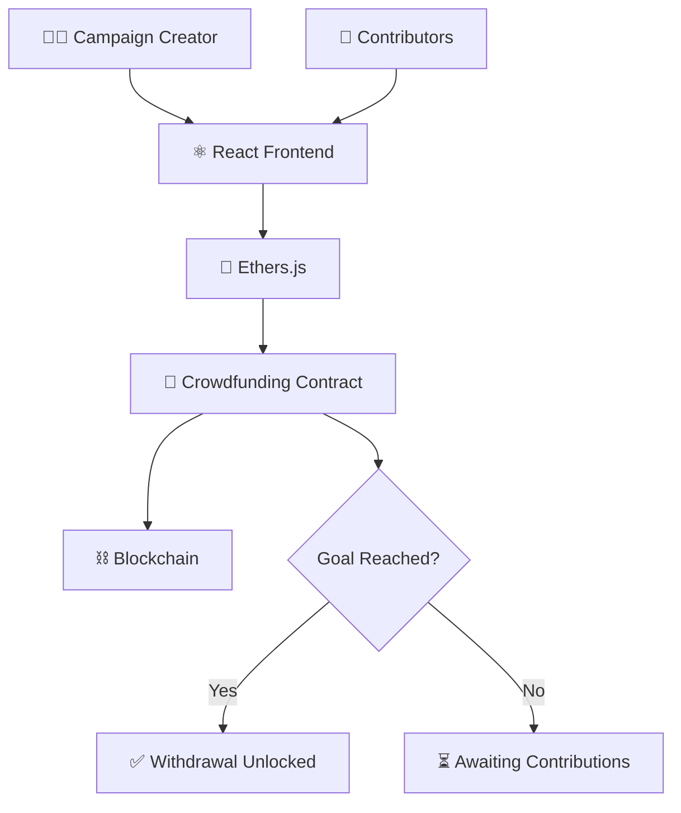

<div align="center">

# 🚀 Crowdfunding DApp

**A trustless blockchain-based fundraising platform with transparent fund management**


</div>

---

## 📑 Table of Contents

- [Overview](#-overview)
- [Features](#-features)
- [Tech Stack](#-tech-stack)
- [Architecture](#-architecture)
- [Smart Contract Functions](#-smart-contract-functions)
- [Getting Started](#-getting-started)
- [Learning Outcomes](#-learning-outcomes)
- [Future Improvements](#-future-improvements)
- [Author](#-author)

---

## 📖 Overview

**Crowdfunding DApp** is a blockchain-based fundraising platform that enables users to create campaigns, contribute funds, and manage donations transparently through smart contracts.

The project demonstrates how blockchain technology can power **trustless fundraising systems** — where fund flows are enforced by code, not intermediaries like GoFundMe or Kickstarter.

---

## ✨ Features

| Feature | Description |
|---|---|
| 📣 Create Campaigns | Launch a new fundraising campaign on-chain |
| 💸 Contribute ETH | Donate ETH directly to any active campaign |
| 📊 Campaign Funding Tracking | Monitor total raised amount in real time |
| 💰 Withdraw Raised Funds | Campaign creators can withdraw after goal is met |
| 👛 Wallet Integration | Connect via MetaMask or any injected wallet |
| 🔍 Transparent Fund Management | All contributions and withdrawals verifiable on-chain |

---

## 🛠 Tech Stack

| Layer | Technologies |
|---|---|
| **Frontend** | React, JavaScript, Ethers.js |
| **Blockchain** | Solidity, Hardhat, Ethereum |

---

## 🏗 Architecture



---

## 📜 Smart Contract Functions

| Function | Type | Description |
|---|---|---|
| `createCampaign()` | Write | Registers a new campaign with a funding goal |
| `contribute()` | Write | Sends ETH to a specific campaign |
| `withdrawFunds()` | Write | Allows the creator to withdraw raised ETH |

```solidity
function createCampaign(string memory _title, uint256 _goal) public {
    campaigns.push(Campaign(_title, _goal, 0, msg.sender));
}

function contribute(uint256 _campaignId) public payable {
    campaigns[_campaignId].raised += msg.value;
}

function withdrawFunds(uint256 _campaignId) public {
    Campaign storage c = campaigns[_campaignId];
    require(msg.sender == c.owner, "Not owner");
    require(c.raised >= c.goal, "Goal not reached");
    payable(c.owner).transfer(c.raised);
}
```

---

## 🚀 Getting Started

### Prerequisites
- Node.js (v16+)
- MetaMask browser extension
- Hardhat

### Installation

```bash
# Clone the repository
git clone https://github.com/Jeevan9898/crowdfunding-dapp.git
cd crowdfunding-dapp

# Install dependencies
npm install

# Compile the smart contract
npx hardhat compile

# Start a local blockchain
npx hardhat node

# Deploy the contract
npx hardhat run scripts/deploy.js --network localhost

# Start the frontend
cd frontend
npm install
npm start
```

---

## 🎓 Learning Outcomes

- Blockchain Fundraising Systems
- Smart Contract Security
- ETH Transfers
- Decentralized Financial Applications
- Contract State Management

---

## 🔮 Future Improvements

- [ ] Campaign Deadlines
- [ ] Milestone-Based Withdrawals
- [ ] Campaign Categories
- [ ] IPFS Campaign Storage

---

## 👤 Author

**Jeevan Yadav**

[](https://jeevan-yadav.vercel.app/)
[](https://github.com/Jeevan9898)
